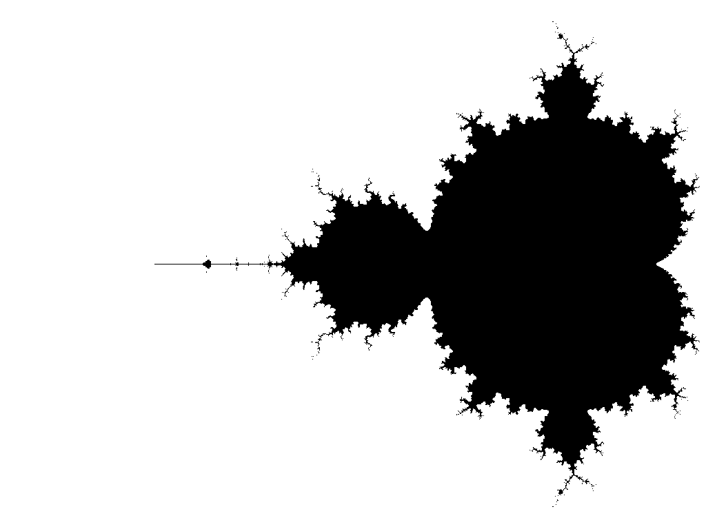

# Mandelbrot set simple PHP Generator

[](https://github.com/mathematicator-core/mandelbrot-set/actions?query=workflow%3A%22Integrity+check%22)
[](https://codecov.io/gh/mathematicator-core/mandelbrot-set)
[](./LICENSE)


Simple Generator for create image of Mandelbrot set as base64 by full-configuration request.

This package was inspired by Pavol Hejný.



## Installation

Via Composer:

```shell
composer require mathematicator-core/mandelbrot-set
```

## Usage

Inject `MandelbrotSet` service to your application, create new Request and process by `loadImage()` method.

## Contribution

### Tests

All new contributions should have its unit tests in `/tests` directory.

Before you send a PR, please, check all tests pass.

This package uses [Nette Tester](https://tester.nette.org/). You can run tests via command:
```bash
composer test
````

Before PR, please run complete code check via command:
```bash
composer cs:install # only first time
composer fix # otherwise pre-commit hook can fail
````
